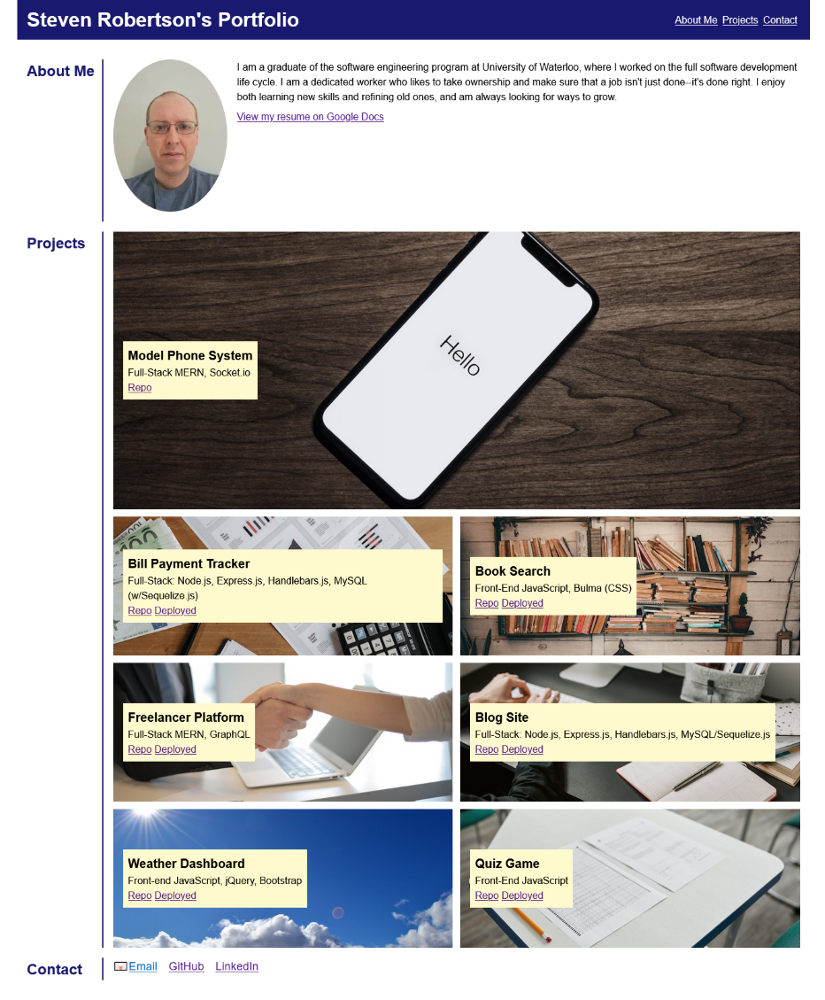

# UTor Bootcamp Challenge 2: Portfolio

## Description
This repo is meant to act as a landing page to showcase my portfolio of projects, and to act
as an early entry demonstrating HTML and CSS.  It contains a brief bio, a list of projects, and 
contact details.  The phone number and email entries are currently artificial; if I add the 
real details at a later date, it will be behind a captcha.  A major part of the assignment was 
to make the page responsive to different sizes using flexbox, grid, and media queries.  I
chose to adopt a mobile first approach, and made the page scale based on font size.

## Usage
[See the portfolio live.](https://s2robertson.github.io/portfolio/)

## Credits

Stock photos used:
* https://www.pexels.com/photo/black-iphone-7-on-brown-table-699122/
* https://www.pexels.com/photo/business-analytic-and-calculator-on-top-of-the-table-7654579/
* https://www.pexels.com/photo/books-on-shelves-2177482/
* https://www.pexels.com/photo/person-in-black-suit-hired-an-employee-3760069/
* https://www.pexels.com/photo/photo-of-man-typing-on-keyboard-4050468/
* https://www.pexels.com/photo/landscape-photograph-of-skies-912364/
* https://www.pexels.com/photo/test-papers-and-pencil-on-the-desk-6683394/

Stock photos from previous versions:
* https://www.pexels.com/photo/flatlay-display-of-electronics-next-to-eyeglases-3184454/
* https://www.pexels.com/photo/female-software-engineer-coding-on-computer-3861972/
* https://www.pexels.com/photo/close-up-photo-of-programming-of-codes-546819/
* https://www.pexels.com/photo/close-up-photography-of-smartphone-icons-267350/
* https://www.pexels.com/photo/black-lighted-gaming-keyboard-841228/
* https://www.pexels.com/photo/abstract-business-code-coder-270348/
* https://www.pexels.com/photo/people-having-business-meeting-together-3183183/
* https://www.pexels.com/photo/business-charts-commerce-computer-265087/

## License
MIT

## Screenshot
